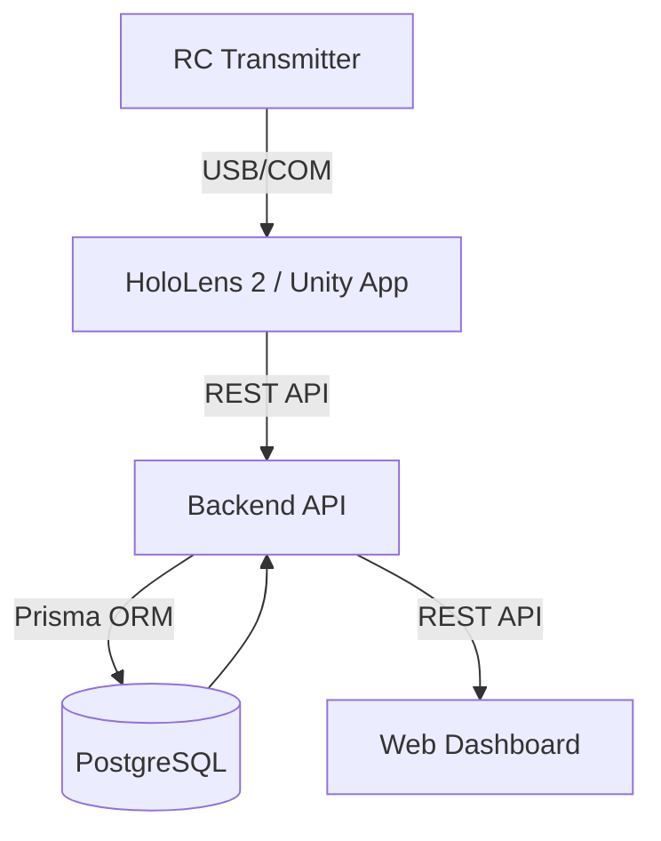

# AERO-MR: Mixed Reality UAV Flight Simulator - Architecture Overview

## 1. Introduction
AERO-MR is a state-of-the-art Mixed Reality (MR) flight simulator designed for the Microsoft HoloLens 2. It provides a production-ready environment for training UAV pilots using spatial mapping, realistic physics, and real-time performance analytics.

## 2. System Architecture
The system consists of three main components:
1. **Unity MR Application**: The core simulation engine running on HoloLens 2.
2. **Backend API**: A Node.js/Express service for telemetry storage and user management.
3. **Web Dashboard**: A React application for performance analysis and monitoring.

### 2.1 Component Diagram

## 3. Technology Stack
- **MR Engine**: Unity 2022.3 LTS + Mixed Reality Toolkit (MRTK)
- **Backend**: Node.js, TypeScript, Express, Prisma ORM
- **Database**: PostgreSQL
- **Frontend**: React, TypeScript, Tailwind CSS, Recharts
- **Infrastructure**: Docker, Docker Compose

## 4. Key Modules

### 4.1 Unity Application
- **Spatial Mapping**: Uses HoloLens 2 sensors to scan the real-world environment and generate physical colliders.
- **Flight Physics Engine**: Custom Rigidbody-based physics simulating lift, drag, gravity, and wind.
- **Transmitter Integration**: Support for standard PWM/PPM transmitters via COM port or USB Gamepads.
- **Training System**: Module for waypoint navigation, landing precision, and obstacle avoidance.

### 4.2 Backend System
- **Session Management**: Tracks flight starts, stops, and durations.
- **Telemetry Processing**: High-frequency storage of drone position, orientation, and pilot inputs.
- **RBAC**: Role-Based Access Control for Admins and Trainees.

### 4.3 Dashboard
- **Analytics Engine**: Processes telemetry to calculate stability scores and smoothness indices.
- **Visualization**: Real-time and historical graphs for flight metrics.

## 5. Deployment
The backend and database are containerized using Docker, allowing for consistent deployment across environments.
